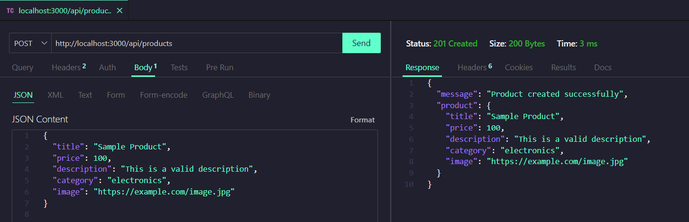
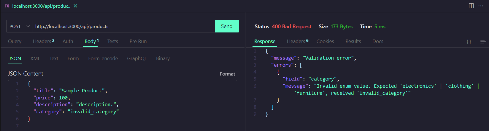
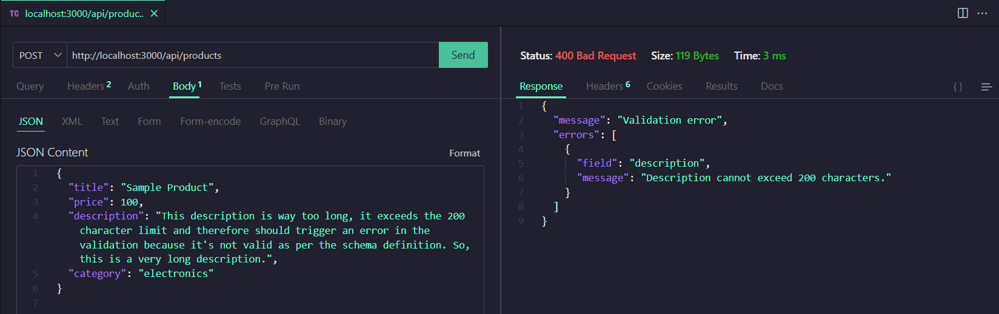
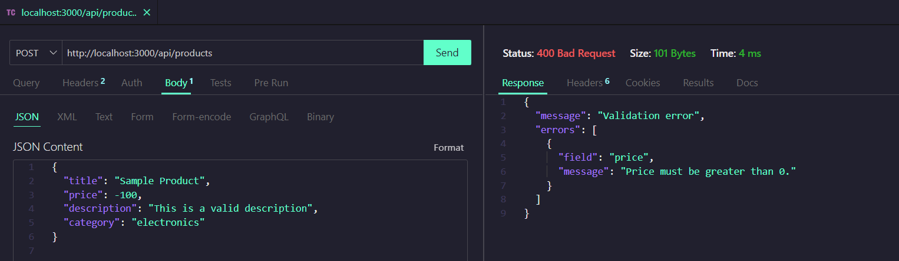
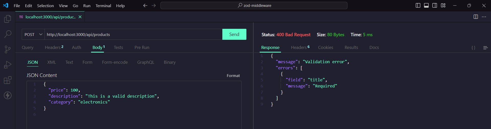

# Make It Real - Validación de Requests con Zod y Middleware en Express.js

This project is a solution to the Request Validation with Zod and Middleware in Express.js challenge in the Make It Real course. It focuses on implementing robust HTTP request validation using the Zod library, ensuring that all data received by the backend adheres to expected formats. A custom middleware is also implemented to manage this validation within an Express.js server.

## Table of contents

- [Overview](#overview)
  - [The challenge](#the-challenge)
  - [Screenshot](#screenshot)
- [My process](#my-process)
  - [Built with](#built-with)
  - [What I learned](#what-i-learned)
  - [Continued development](#continued-development)
  - [Useful resources](#useful-resources)
- [Author](#author)
- [Acknowledgments](#acknowledgments)

## Overview

### The challenge

1. Create a validation schema using Zod:

- Define a schema using Zod to validate the data of a POST request that creates a new product.
- The product object must have the following fields:
  - title: A required string.
  - price: A required number that must be greater than 0.
  - description: A required string with a maximum length of 200 characters.
  - category: A required string.
  - image: A valid URL (optional).

2. Implement a validation middleware:

- Create a middleware that validates the body of the request (req.body) against the Zod schema.
- If validation fails, the middleware should return a response with status code 400 and a message indicating the validation errors.
- If validation succeeds, the request should proceed to the next middleware or controller.

3. Create a POST route in Express.js:

- Implement a POST route in the Express.js server to handle the creation of new products.
- Apply the validation middleware to this route.

4. Validation tests:

- Send test requests to the POST route with incorrect data (e.g., missing the title field, with a negative price, etc.) and verify that validation works as expected.
- Also, send valid requests and ensure that they pass validation and reach the controller.

5. Additional validation:

- Implement additional validation to ensure that the category field only accepts specific values (e.g., "electronics", "clothing", "furniture").

### Screenshot







## My process

- Configure node to use TypeScript with tsx
- Scaffolding
- Define product schema using Zod
- Build the middleware
- Setting up routes
- Testing the API using Thunder Client

### Built with

- Node.js: JavaScript runtime to build the server.
- Express.js: For building the API and handling routes.
- Zod: To define and enforce validation schemas.
- TypeScript: To ensure type safety throughout the project.

### What I learned

Zod provides a clear and concise way to handle complex validation in TypeScript. Using schemas allows you to define what your data should look like and automatically check for errors.

```js
description: z.string().min(1, "Description is required.").max(200, "Description cannot exceed 200 characters."),

```

### Continued development

Experiment with asynchronous validation where necessary (e.g., checking if a field exists in a database).

### Useful resources

- [Zod documentation](https://www.npmjs.com/package/zod-express-middleware) - This resource was crucial for understanding how to structure my validation schemas and integrate them with TypeScript and Express.js.

## Author

- Linkedin - [Juan Alva](www.linkedin.com/in/juan-luis-alva)

## Acknowledgments

I would like to thank the Make It Real instructors and my peers for their guidance and support throughout this project. Special thanks to my cohort for sharing valuable feedback.
